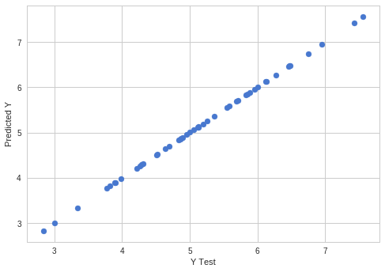
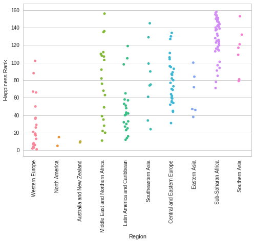
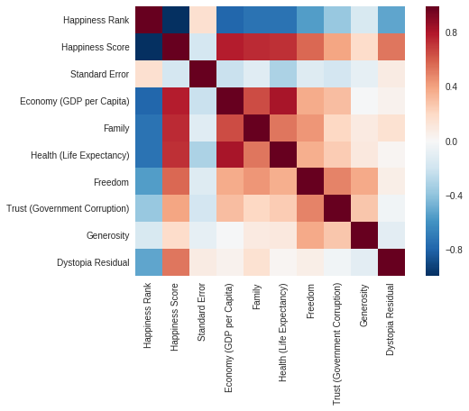
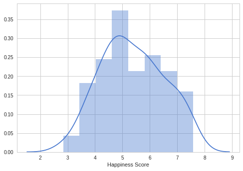

Investigating Happiness With Python

The following are the results of data analysis
1.
| Country      | Region         | Happiness Rank | Happiness Score | Standard Error | Economy (GDP per Capita) | Family | Health (Life Expectancy) | Freedom | Trust (Government Corruption) | Generosity | Dystopia Residual |
|--------------|-----------------|----------------|------------------|----------------|--------------------------|--------|-------------------------------|---------|----------------------------------|---------------|--------------------|
| Switzerland | Western Europe  | 1              | 7.587            | 0.03411        | 1.39651                  | 1.34951| 0.94143                       | 0.66557 | 0.41978                           | 0.29678      | 2.51738              |
| Iceland      | Western Europe  | 2              | 7.561            | 0.04884        | 1.30232                  | 1.40223| 0.94784                       | 0.62877 | 0.14145                           | 0.4363        |                    |

2.

3.

4.

5.

6.
| Standard Error                | -0.000663                  |
|--------------------------------|----------------------------|
| Economy (GDP per Capita) | 1.000128                   |
| Family                               | 0.999810                   |
| Health (Life Expectancy) | 0.999984                   |
| Freedom                           | 0.999720                   |
| Trust (Government Corruption) | 0.999885                |
| Generosity                     | 0.999747                   |
| Dystopia Residual           | 0.999955                   |
